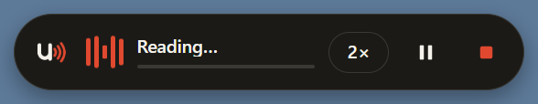
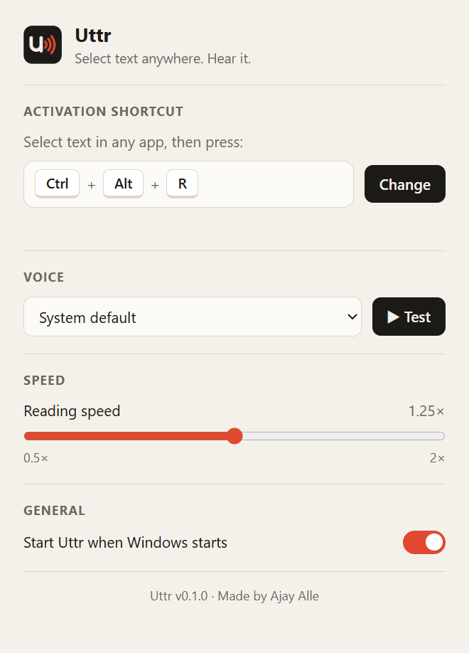
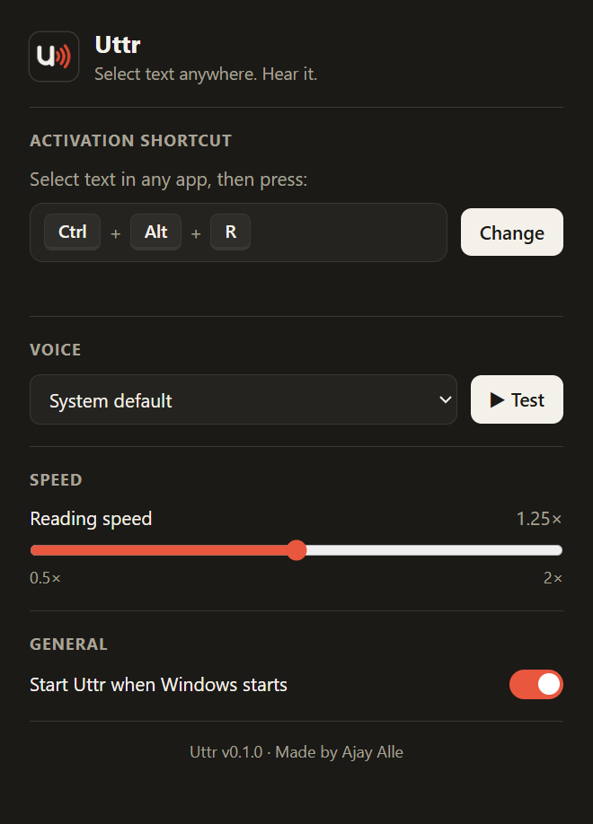

<p align="center">
  
</p>

<h1 align="center">Uttr for Windows</h1>

<p align="center">
  <strong>Select text in any app. Press a shortcut. Hear it.</strong><br>
  <sub>by <strong>Ajay Alle</strong></sub>
</p>

<p align="center">
  <a href="https://github.com/ajayalle10/uttr-desktop/releases/latest/download/Uttr-Setup.exe"><strong>⬇ Download for Windows</strong></a>
  &nbsp;·&nbsp;
  <a href="#install">How to install</a>
  &nbsp;·&nbsp;
  <a href="https://github.com/ajayalle10/uttr">Browser extension</a>
</p>

<p align="center">
  
</p>

---

Uttr reads text aloud from **anywhere on your computer**: Word, PDFs, Outlook, Slack, WhatsApp Desktop, Notion, any browser. Select some text, press **Ctrl + Alt + R**, and a small bar appears at the bottom of your screen and reads it to you. It works like Wispr Flow, but in reverse: instead of turning your voice into text, it turns text into voice.

- **Works in every app.** One shortcut, everywhere.
- **Floating bar** with pause/resume, speed and stop. It never steals focus from what you're doing.
- **Your shortcut:** change the activation keys to anything you like.
- **Private:** speech is made by Windows' built-in voices on your own computer. No account, no tracking, nothing sent anywhere.
- **Updates itself** quietly in the background.

## Install

1. **[Download `Uttr-Setup.exe`](https://github.com/ajayalle10/uttr-desktop/releases/latest/download/Uttr-Setup.exe)** (about 110 MB).
2. **Double-click it.** Uttr installs in a few seconds and starts straight away. No admin rights are needed.
3. **If Windows shows a blue "Windows protected your PC" screen:** click **More info**, then **Run anyway**.

   > **Why does that appear?** Windows shows it for any new app that isn't signed with a paid code-signing certificate. Uttr's source code is public in this repo, so you can read every line of it.

4. You'll see **"Uttr is ready"** at the bottom of your screen, and the Uttr logo in the system tray near the clock. It may be hidden under the **^** arrow.

Installing also adds **Uttr** to the Start menu and the desktop.

## How to use

| I want to… | Do this |
|---|---|
| **Hear some text** | Select it in any app, then press **Ctrl + Alt + R** |
| **Switch to different text** | Select the new text and press the shortcut again |
| **Stop** | Press **Esc**, press the shortcut again, or click **■** on the bar |
| **Pause / resume** | Click **⏸ / ▶** on the bar. It resumes from the same word. |
| **Change speed** | Click the **1×** button on the bar, or use the slider in Settings |
| **Change the shortcut, voice or speed** | Click the Uttr tray icon to open **Settings** |

<p align="center">
  
  &nbsp;
  
</p>

### Settings
- **Activation shortcut:** click **Change** and press any combination with Ctrl, Alt or the Windows key, for example Ctrl + Shift + Space. It works straight away. If another app already uses that combination, Uttr tells you and keeps your old one.
- **Voice:** any voice installed in Windows, with a **▶ Test** button. To get more voices, go to Windows **Settings → Time & language → Speech → Add voices**.
- **Speed:** 0.5× to 2×.
- **Start Uttr when Windows starts.**

### Updates
Uttr checks for new versions when it starts and every few hours. It downloads them in the background and installs them the next time Uttr restarts. You can also right-click the tray icon and choose **Check for updates**.

### Uninstall
Go to **Windows Settings → Apps → Installed apps → Uttr → Uninstall**. This also removes Uttr from your startup apps.

## Privacy

- **Speech happens on your computer**, using Windows' own voices.
- **No account, no analytics, no tracking.** The only thing Uttr ever connects to is this GitHub page, to check for updates.
- **How Uttr reads your selection:** Windows doesn't let one app ask another "what's selected?". So when you press the shortcut, Uttr briefly copies your selection (Ctrl+C), reads it, and then **puts your clipboard back exactly as it was**. Nothing is stored or sent anywhere. Windows' own clipboard history (Win + V), if you have it turned on, may still list the copied text.
- **Esc to stop:** while the bar is showing, Uttr watches for the Esc key, and only the Esc key. It stops watching as soon as the bar closes.

## Troubleshooting

| Problem | Fix |
|---|---|
| Nothing happens when I press the shortcut | Check that the Uttr icon is in the tray. If not, start Uttr from the Start menu. |
| "Select some text first" | The app didn't allow copying. Password fields and some protected apps block it. |
| A message says the shortcut is already used | Another app owns that key combination. Choose a different one in Settings. |
| It doesn't work in one particular app | Apps running **as administrator** can't be read by normal apps. That's a Windows security rule. |
| I only have 2 or 3 voices | Add more in Windows **Settings → Time & language → Speech**. |

---

## For developers

Built with **Electron** (HTML, CSS and JavaScript), so one codebase can later target Mac too.

```bash
git clone https://github.com/ajayalle10/uttr-desktop.git
cd uttr-desktop
npm install
npm start          # run from source
npm run dist       # build dist/Uttr-Setup.exe
npm run release    # build and upload a DRAFT GitHub release (needs GH_TOKEN)
```

**Releasing a new version:**
1. Bump `"version"` in `package.json`, for example `0.1.0` → `0.2.0`, and commit.
2. Run `npm run release`. This builds the installer and uploads `Uttr-Setup.exe`, `latest.yml` and the `.blockmap` to a draft release tagged `v0.2.0`.
3. Publish the draft on GitHub (or `gh release edit v0.2.0 --draft=false --latest`). Installed copies pick up the update within a few hours.

### How it works

```
 Any app (Word, Chrome, PDF…)          Uttr main process (main.js)                 Floating bar (bar/)
 ────────────────────────────          ───────────────────────────                 ───────────────────
 user selects text,          ───────►  global shortcut fires
 presses Ctrl+Alt+R                    selection.js: back up clipboard,
                                       press Ctrl+C, read it, restore clipboard
                                       show bar (without stealing focus)  ───────► split into sentence chunks
                                                                                   speechSynthesis (Windows voices)
                                       Esc listener (uiohook) ◄─── state ────────  word-by-word progress,
                                       only while the bar is visible               pause / speed / stop
```

| File | What it does |
|---|---|
| `main.js` | The "brain": tray, global shortcut, windows, settings, Esc listener |
| `selection.js` | Grabs the selected text from any app via the clipboard, restoring it afterwards |
| `bar/` | The floating bar: reading queue, word tracking, pause/resume, speed |
| `settings-window/` | The Settings window, including the shortcut recorder |
| `shared/chunker.js` | Splits text into sentence-sized chunks (same algorithm as the browser extension) |
| `shared/shortcut.js` | Turns key presses into shortcuts and "Ctrl + Alt + R" labels |
| `updater.js` | Automatic updates from GitHub Releases |
| `preload.js`, `settings-window/preload.js` | Safe bridges: each window can only call the few functions it needs |

### Some problems solved along the way
- **Copying from any app:** Uttr presses Ctrl+C for you while you're still holding Ctrl+Alt. It first tells Windows those keys are released, and taps an unused key (F24) so that releasing Alt doesn't open the app's menu bar.
- **A bar that never takes focus:** Windows swallows the mouse *press* on no-activate windows, so the bar's buttons act on the mouse *release* instead.
- **Chrome's speech timing bug:** calling `cancel()` then `speak()` immediately can drop the new speech. Uttr only cancels when it's really interrupting, waits briefly, and retries.
- **Resuming mid-sentence:** the voice's word-boundary events tell Uttr exactly which word it's on.

## Roadmap
- [ ] Mac version
- [ ] Android: "Uttr" in the menu that appears when you select text
- [ ] Word-by-word highlighting in the bar
- [ ] Natural AI voices
- [ ] "Read anything I copy" mode

## Author

**Ajay Alle** · [@ajayalle10](https://github.com/ajayalle10)

Also by Ajay: the **[Uttr browser extension](https://github.com/ajayalle10/uttr)**, which auto-reads selected text in Chrome, Edge and Firefox.
